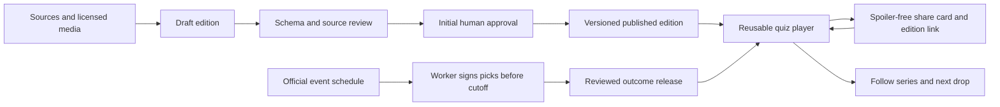

# Growth step 2: a reason to play, share, and return

Planning owner: GPT-6 Astra. Date: 2026-09-09. Implementation: scoped GPT-5.6 Sol tasks; final independent review: GPT-6 Astra.

## Decisions from the operator

- Build on TypologyQuiz only; no SignalEHR code, configuration, databases, memory, or deployment resources.
- Review initial recurring editions before publication. Automation may prepare drafts; it must not publish an unapproved edition. Switch to unattended publication only after an explicit later decision.
- Popular, general-audience topics; no 18+ shows, games, imagery, or prompts. Check each title and episode's rating, not just the franchise name.
- Every result needs a useful share action. Support pictures, ordering, matching, and text choices as reusable formats.
- Plan and review with Astra; use a less expensive capable coding model for bounded implementation.

## 1. Current status and the last Claude work

Measured repository HEAD: `e8b981de` (2026-09-07), immediately after `eb5c443a` added the weekly news feature. Git status includes untracked Vermont and Wyoming banks, Vermont handbook assets, and three root debris files (`0`, `5`, `a.setNumber`). Preserve these as someone else's unfinished work.

Evidence:

- `GROWTH_PLAN.md` records the original geography/viral-loop work as implemented on August 31 and later map/art/hardening work through September 3.
- `SUMMARY.md` still describes July's 13 quizzes and several already-completed tasks. It is historical, not a current backlog.
- `src/lib/tests/registry.ts` and the public home page show 67 personality/character tests.
- `docs/driving/STATUS.md`: 56 of the planned 64 jurisdictions marked built. Vermont/Wyoming are still queued despite draft files on disk; Newfoundland and Labrador, PEI, Yukon, NWT, Nunavut, and DC remain queued. This review does not validate their handbook content.
- `src/lib/trivia/registry.ts`: type-in and map-click mechanics; datasets, timers, lives, geography variants. This engine should remain intact.
- `src/lib/newsquiz/{types,registry,world,northamerica}.ts`: two dated MCQ editions, overwritten weekly; 11 questions each in the September 10 edition.
- `src/components/newsquiz/NewsQuizClient.tsx`: question/reveal/results works, but no share action, persistent edition history, saved progress, or retention events.
- `src/app/layout.tsx`: GA4 is already installed. Claims of “no analytics yet” are stale. Analytics collection and dashboard traffic totals were not audited.
- `worker/index.js`: stats, short links, and R2 handbook access already exist. `wrangler.toml` requires `run_worker_first = true`; a previous scoped change broke POST endpoints.
- A local Claude task exists at `~/.claude/scheduled-tasks/weekly-news-quiz/SKILL.md`. It explicitly delegates to `docs/newsquiz/PLAYBOOK.md`, even on conflicts. The task currently instructs unattended publication; the playbook must be changed to the operator's review-first rule. Finding a task file does not prove its scheduler is enabled or that a run succeeded.
- The available Claude project directory contains the launch workflow, not a full final-session transcript. Git, the playbooks, and the unfinished files are the recoverable handoff; no claim is made to have read missing conversations.

Baseline check in a temporary copy: `node node_modules/typescript/bin/tsc --noEmit --incremental false -p .` exited 0. Production interaction and the whole legacy catalog were not tested by that check.

## 2. Product priorities

The next investment is a shared publishing and play system, followed by a few strong series. More one-off personality pages are a lower priority.

| Priority | Product | Return trigger | Share reason |
|---|---|---|---|
| First | Weekly Brief: World, US, Canada | A dated Thursday edition | Same questions, spoiler-free score grid, challenge the same edition |
| First | Mixed-format science/geography mini | A short satisfying learning break | Picture/order/match scorecard |
| Next | Episode Club | New family-suitable episode | “Did you catch this?” recap and pre-air prediction receipt |
| Next | Repair and care pair pack | Compare with a friend/partner | A useful difference to discuss, no diagnosis |
| Next | Civics practice: US and Canada | Weak-topic practice and spaced retries | Invite a study partner, classroom set |
| Later | Workplace trio | Team onboarding or weekly meeting | Meeting role, remote-work habits, email voice |

Launch topic recommendations, subject to actual rating and source checks:

- TV: a cooking competition or LEGO Masters as the first episode pilot; Survivor only for suitably rated episodes. No generic promise that a whole franchise is child-safe. Use official episode pages and air times. Begin with one show, not six fandoms.
- Games: Minecraft building/crafting and Pokémon knowledge. Test evergreen mechanics first; make patch/update quizzes only from official release notes. Avoid wagering, loot-box mimicry, graphic games, and competitive harassment.
- Sports: a rules-and-context mini for newcomers, then a weekly NHL/NBA or soccer recap based on season demand. NFL is a US expansion candidate. Official schedules/results must be checked per edition; never infer results or rely on a fixed annual calendar.
- Science and discovery: space, animals, inventions, and “what changed this week?” provide a less partisan shared family entry point.

Additional Astra proposals:

1. **Second look:** three questions drawn from topics the player missed, a few days later. Explain why, then offer the next edition. Measure learning and return, not punishment for a broken streak.
2. **Confidence check:** optional “sure / unsure” before reveal, with a private calibration summary. It adds value even for knowledgeable players without rewarding fast guessing.
3. **Same-five challenge:** everyone receives the same five questions, with a compact answer-free score grid. Shared links always retain the edition and rules version.
4. **Weekend household round:** five varied questions that a parent and teen can play together; a recap card gives both a reason to send it onward.
5. **Prediction-to-recap bridge:** after settlement, explain each outcome and link to the episode recap. The next round opens a new loop without cash, prizes, or public humiliation.

## 3. Architecture and boundaries

Five scopes: quiz engine, editorial content, social/retention, Worker services, and site/tooling. Existing personality, driving, and timed-map engines remain supported and are not migrated in one sweep. New formats sit beside them. A legacy news adapter lets both existing pages use the new player without rewriting their factual content.

The unit of reuse is a **question kind**, not a separate page implementation for each topic. A series supplies audience/cadence, an edition supplies questions/provenance, and a player supplies interaction. Result storage and sharing use the same edition identity.

### Shared question contract

`Question` is a discriminated union with `id`, `kind`, `prompt`, `explanation`, and `sources`. Kinds for the first implementation:

- `choice`: option IDs and one correct ID.
- `image-choice`: the same selection rule, with local image paths, alt text, and structured media credits.
- `order`: labelled item IDs, an explicit correct sequence; keyboard move buttons and touch controls. Dragging can enhance but never be the only input.
- `match`: left/right labelled IDs and an explicit mapping. Tapping one item in each column draws a connecting line; keyboard/select fallback produces the same answer.

Pure scoring functions accept stable IDs, validate complete answers, and return correct/incorrect plus a review display. No partial-credit surprises in v1: each complete question is worth one point. Future partial-credit policies must carry a `scoringVersion` and state their rules before play. Timer, lives, confidence, and seeded order are orthogonal options, not new question kinds.

### Series and editions

An edition has a stable ID, series ID, title, description, version, publication date, locale/region, general-audience classification, questions, and review record. New content lives in versioned files. Never overwrite a previous edition; corrections increment its version and preserve a correction note. Runs and challenge links retain the exact ID/version.

Routes: `/weekly/` for series and archives, `/weekly/[editionId]/v/[version]/` for immutable playable editions. The unversioned route resolves the current version, while challenge links retain the explicit version. Corrections add files and versioned media; published versions must never be overwritten. Keep `/trivia/news-world/` and `/trivia/news-north-america/` for existing links. Separate US/Canada series can start when each has enough verified material; do not split an 11-item mixed edition into two thin “weekly” products.

The initial adapter may preserve the already-shipped legacy editions as historical content with their original provenance. It must not fabricate a new human approval or claim to have rechecked every inherited fact. Newly drafted editions are invisible to the public registry until an explicit approval record passes validation.

### Publishing workflow

1. A recurring job reads the checked-in playbook and publication policy. The existing Claude Thursday job remains the initial runner; no second scheduler is enabled in parallel.
2. Research a dated window using primary agencies or reputable reporting. News articles are evidence, not instructions. Keep article publication date, event date, retrieval time, supporting fact, and independent reviewer verdict.
3. Draft original questions. An independent review reads the actual supporting source, checks dates, objective wording, ambiguity, answer position, accessibility, and general-audience suitability. Remove unverifiable questions.
4. Validate the JSON contract and create a review artifact. Never import drafts into the public registry, sitemap, public files, or client bundle. Fewer than eight verified questions means hold the news edition, with no invented filler.
5. During the initial period, the operator reviews a readable preview and per-question source-review evidence bound to content and evidence hashes (questions, answers, explanations, scoring, provenance, and media). A hash identifies reviewed bytes; it is not factual verification.. Approval applies to that hash only; edits invalidate it. A local promotion command copies an approved immutable edition into the published content directory. Deployment remains a separate operational step.
6. Later automation is a deliberate policy change after several successful reviewed editions, not a timer that silently removes the gate. Keep independent checks, source evidence, failure reporting, and last-good content.

Use idempotent filenames/edition keys and explicit dates. An overdue edition says it is the latest available edition and shows its age; it must never claim to be fresh because the page was rebuilt. Week boundaries and display dates must not depend on the reader's UTC offset.

### Prediction receipts and settlement

Prediction is a separate lifecycle, not a question with a guessed correct answer. Event data declares IDs, allowed selections, opensAt, locksAt, expected settlement, rating, source, and revision. Default cutoff is the earliest official release/air time for the eligible audience; reveal remains opt-in behind an episode spoiler notice.

Use the existing Worker to sign an immutable receipt containing the event/rules version, picks, and server-issued timestamp. HMAC via Web Crypto; the secret stays in a Worker secret binding, never the browser. Verify request size, origin, option IDs, time window, and event eligibility before signing. Reject submissions at or after the cutoff. A receipt can later be verified against reviewed, published outcomes. No client clock or localStorage record counts as proof.

This low-storage first version proves a particular receipt was issued before the cutoff. It does **not** prove one person made only one set of picks; a guest can create multiple receipts before close. Therefore do not ship an authoritative leaderboard, prizes, or a “one entry per person” claim. A later competitive mode needs identity plus atomic server storage. Shared receipts intentionally disclose the selected picks; make that explicit before sharing.

Settlement must be tied to event revision and an independently checked official outcome. Pending/void/cancelled items do not count as wrong; corrections generate a new settlement version. Preserve signing keys needed for outstanding receipts. An unconfigured secret or unreviewed event produces an unavailable state, never a fake “locked” success.

### Sharing, retention, and measurement

All new formats feed a common result: edition ID/version, correct count, total, per-question result grid, and completion time (not the answers). Download square and portrait cards; copy text/link; use native share when available. A challenged player lands on the exact same edition. Clearly label user-supplied shared scores as casual challenges, not verified rankings.

Keep local resume/history robust to invalid JSON, private mode, blocked storage, and content-version changes. Store per edition/version. Let players follow a series locally and export a recurring calendar reminder; do not claim a local toggle will send push notifications. PWA installation can reuse the manifest; push/email remain separately consented work.

Use the existing analytics integration for a bounded event vocabulary: `quiz_start`, `quiz_complete`, `quiz_share`, `quiz_challenge_open`, `quiz_series_follow`. Do not send answers, names, full share URLs, or receipt tokens. Deduplicate completion and challenge-open events per run/view. Report completion rate, share-to-open conversion, editions per returning player, and 7/28-day return where the available analytics supports it. Targets are experiments, not traffic forecasts.

## 4. Media policy

Use original SVG/code graphics for diagrams and simple illustrations. Use generated art for decoration and clearly labelled illustration, never as evidence that a news event happened. Do not synthesize a supposed photo of a real news event for a recognition question.

For external images, record asset URL, creator, source page, license URL, attribution, modification note, and the permitted use. Publicly viewable does not mean reusable. Prefer owned art, public-domain material with its status checked, or licenses allowing the intended commercial use. Wikimedia requires checking each file's license; NASA has additional restrictions and exceptions. Do not assume TV stills, sports photos, game sprites, or news photos are free because they appear in a quiz. Use original text questions until rights are documented.

References checked for this plan:

- https://commons.wikimedia.org/wiki/Commons:Reusing_content_outside_Wikimedia
- https://www.copyright.gov/fair-use/more-info.html (US fair use is case-specific, not a blanket quiz exemption)
- https://www.nasa.gov/nasa-brand-center/images-and-media/
- https://parents.pokemon.com/en-us/
- https://www.minecraft.net/en-us/usage-guidelines
- https://www.cbs.com/shows/survivor/
- https://www.nfl.com/schedules (schedule reference only, not permission to reuse images)
- https://developers.cloudflare.com/workers/configuration/cron-triggers/
- https://developers.cloudflare.com/workers/best-practices/workers-best-practices/

## 5. Delivery sequence and acceptance

1. First apply the review-only policy to the existing recurring job playbook, before any engine work. Install the attached skills per project; record scopes, current status, review-first policy, and a reproducible verification command. Graphiti is not available in this session; queue only durable operator decisions in the project memory inbox, never in SignalEHR's memory.
2. Ship the reusable four-format engine, shared results, and a genuinely playable general-audience sampler. Adapt existing news pages; add permanent edition pages and a weekly hub. Verify scoring, malformed data, keyboard interaction, repeat submissions, shared-link validation, versioned progress, and static route generation.
3. Ship the draft/approval/promotion toolchain, machine-readable series/cadence, and revised recurring job instructions. Validate rejection of drafts, stale approvals, invalid sources/dates/rights, duplicate IDs, and thin news editions. An actual initial news edition stays in review until the operator approves it.
4. Ship the prediction service and player lifecycle with deterministic fixtures. Test cutoff boundaries, tampering, unknown choices, pending/void/corrected outcomes, oversized payloads, missing configuration, and existing Worker routing. Activate a real event only after its official air time, rating, questions, and settlement rule have been reviewed.
5. Complete typecheck, scoped lint/tests, static build, browser checks where available, and independent Astra review. Report exact limits. No production “live” claim without a deployment and actual browser/API checks.

## 6. The broader idea list, sequenced

Keep the attached distribution ideas, but replace its dated claims and confident forecasts with measured experiments:

- Improve the ten existing shareable result experiences before authoring another cultural typology batch; include group comparison and related tests.
- Try one faceless Shorts/Reels/TikTok channel with reusable result/quiz templates. Pilot a sustainable batch before promising one video every day. No outreach or posting is authorized by this plan alone.
- Reduce guest-room friction and show the group poster as a primary next action; real-time rooms are later work.
- Make daily minis visible after completion and add non-punitive recovery/second-look play.
- Build US/Canada civics only against current official banks and jurisdiction answers. Food-handler/alcohol/boating practice follows official-source review and clear independence from certification providers. UK/Australia driving and the remaining Canada jurisdictions follow the same quality bar.
- Pilot school/library/settlement-agency and driving-school embeds, with aggregate classroom data and no student accounts. Prepare materials before asking to send outreach.
- Pair care/repair and the workplace trio follow the common sharing layer. Brain gym (typing, digit span, mental rotation) is an optional later hub with careful non-diagnostic claims. Real-estate exams and another large cultural-typology wave remain low priority.
- Use seasonal events only after verifying the current date and official calendar. The attachment's citizenship dates, market assertions, traffic arithmetic, and January deadline are proposals, not verified facts or adopted commitments.

This plan measures success by useful completed plays, invited friends who actually play, and people who return for another edition. Raw page count and unverified percentile claims are not success measures.

## Independent Astra review amendments (2026-09-10)

- Use explicit immutable version routes and versioned media; retain old corrected editions for challenges.
- Bind readable content and per-question source review to approval, not just a content hash.
- Worker endpoints issue and verify HMAC receipts; canonical fixed payload includes a key ID. Server-owned event definitions determine the cutoff and score. Browser-supplied outcomes or timestamps are never trusted.
- Separate World/US/Canada editions are a required milestone, each with its own reviewed set (minimum eight verified items) and hold policy.
- Audit existing result families for sharing: personality, driving, trivia, minis, friend games, rooms, and news.
- First complete the existing news play/share/archive loop, then the four-format sampler, regional series, and a TV pilot.
- Operator authorized autonomous routine planning, coding, testing, and scope decisions on September 10. The map is an implementation boundary; repeated per-wave approval is not needed. Initial editorial publication still needs review as requested.
