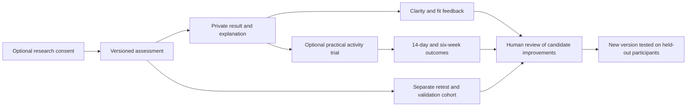

# Better personality tests and more useful feedback

TypologyQuiz can build a more credible assessment service by making fewer, clearer claims and testing them properly. The strongest first step is a transparent Big Five assessment, followed by optional feedback and practical exercises whose benefits are evaluated separately. Entertaining archetypes can remain part of the brand, with clear labels describing their purpose.

TypologyTesting provides useful examples of public methods and item statistics. Its public evidence does not establish that its Jungian types are objectively correct, or that its tests outperform established personality measures. Copying its terminology, item bank, or scoring approach would not solve that problem. The opportunity is to publish reproducible evidence for a defined test version and help people understand what a result can and cannot tell them.

## Scope and strength of evidence

This is a targeted critical literature review covering publications from January 2020 through September 11, 2026, alongside a current competitor review and an inspection of the TypologyQuiz repository at commit `1975052f`. It includes 18 scholarly sources: empirical studies, reviews and one explicitly identified 2026 preprint. Official instrument documentation, licensing pages and the 2025 ITC/ATP assessment guidelines supplement the scholarly evidence.

The search covered Big Five and brief scales; Jungian/MBTI and Enneagram evidence; item response theory; careless responding; cultural adaptation; personality feedback; behavioural outcomes; and conversational AI assessment. Publisher pages, PubMed, university repositories and official instrument sites supplied the evidence. Full text or substantive methods/results were examined where available. Abstract-level restrictions are identified below. Social posts, commercial summaries and search-result popularity were not treated as scientific validation.

This is not a preregistered systematic review, an exhaustive database search or a new meta-analysis. No independent reanalysis of participant data was performed. Publication date and data-collection date are different: the 2024 Kang study used 2020 data, the 2024 Perry trial used 2020–2021 data, and the 2021 PEACH trial used 2018–2019 data. Reviews published within the window also summarize earlier research. Where collection dates were not established in the inspected material, they remain unspecified. The 2026 literature is necessarily incomplete.

The recommendations target voluntary adult self-reflection. Driving knowledge, factual trivia, cognitive performance and clinical assessment need separate validation plans. Findings about one instrument, population or delivery format do not automatically transfer to another.

## What TypologyTesting actually supports

The competitor presents four sources of credibility: a psychological framework, statistical scoring, visible data and practitioner involvement. These should be assessed separately.

| Public claim or feature | What was observed | Assessment |
|---|---|---|
| Scientifically accurate personality assessment | The home page describes data science, cognitive functions, IRT calibration and ongoing improvement. | These identify an approach, rather than demonstrate comparative accuracy. [19](https://www.typologytesting.com/) |
| More precise scoring and a living item bank | The philosophy describes estimating item properties, retiring weaker items and several test lengths. | Useful development practices if the model assumptions, sample and independent validation hold. [20](https://www.typologytesting.com/our-philosophy) |
| Public accuracy and reliability | The dashboard exposes self-type agreement, alpha/omega, item grades and usage statistics. | Transparency is a strength; different metrics need distinct names and interpretations. [21](https://www.typologytesting.com/data) |
| Open source | The expanded FAQ says substantial scoring/item code is published, but the inspected answer links to data and philosophy rather than a repository. | A reproducible code release and license were not verified in this review. This is a verification gap, not proof that none exists. [22](https://www.typologytesting.com/faq) |
| Qualified typologists | The About page describes its own practitioner review and platform. | Practitioner review can improve explanations; it is not independent psychometric certification of a test. [23](https://www.typologytesting.com/about) |
| Research use of responses | Privacy and terms describe retained assessment data and research/aggregate uses. | Participation and research rights need careful reading; public statistics are not permission to reuse protected questions. [24](https://www.typologytesting.com/privacy), [25](https://www.typologytesting.com/terms) |

On September 11, the default accuracy view showed **30.1% agreement among 588 self-reported tests**, with filters **Full Test / version 4 / Yes + Kinda surety**; the displayed total for that form/version was 1,381 completions. The comparison was against a type declared before testing. It therefore measures agreement with prior self-identification, not objective correctness. Disagreement cannot establish which result was wrong. The Test Stats view showed version 5, while its reliability table defaulted to all versions: alpha ranged .57–.69 and omega .93–.97, with different coverage values. Those figures require the estimation model, missing-data treatment and form-specific samples to be interpretable. They are not interchangeable measures of validity. The inspected reliability section also displayed a sign-up gate. These are dynamic, filter-dependent observations, not a permanent site-wide accuracy estimate. [21](https://www.typologytesting.com/data)

No independent, peer-reviewed validation of this site's exact current Jungian assessment was located in the reviewed pages and focused searches. A convincing validation package would identify the exact item/scoring version, recruitment, unique participants, exclusions, model fit, repeatability, external comparisons and independent replication. A score map or UMAP cluster display can help exploration, but does not by itself establish that nature contains sixteen discrete personality types.

The useful competitive lesson is to make methods inspectable. The proposed improvement is to distinguish **reliability**, **evidence for an interpretation**, **user agreement**, and **practical benefit**, instead of presenting them as one accuracy score.

## Literature findings that change the product decision

### Established traits are the best starting point, but brief tests have limits

**1. Husain and colleagues, 2025 — BFI/BFI-2 reliability synthesis.** The review reports 57 study datapoints from 34 articles involving 43,715 participants and multiple languages. BFI-2 generally showed better internal consistency than BFI, with substantial variation across studies. This supports established dimensional measures as a starting point, but internal consistency does not establish individual accuracy, causal usefulness or the validity of TypologyQuiz's implementation. The paper also contains inconsistencies in some narrative counts and numerical descriptions; precise benchmarks should be independently checked before operational use. It is not a source of ready-made norms for our visitors. [1](https://link.springer.com/article/10.1186/s40359-024-02271-x)

**2. Kang and colleagues, 2024 — a short scale tested at population scale.** Three GBIT datasets comprised 59,797 participants at baseline, 21,177 returning participants, and a further cohort of 87,983. The 18-item BFI retained useful structure and repeatability relative to shorter alternatives. The returning group overlaps the baseline; these are not three independent samples to sum. Data were collected in 2020. This is evidence that a short mobile assessment can be developed empirically, not permission to select eighteen appealing items and inherit the results. Associations with reported conditions do not make the questionnaire a diagnostic test. Publisher abstract and university-hosted article extracts were available. [2](https://www.sciencedirect.com/science/article/pii/S0010440X24000658)

**3. Yoshino and colleagues, 2022 — Japanese BFI-2 adaptation.** Samples of 487 undergraduates and 500 adults supported the translated instrument's structure, reliability, external associations and age/sex measurement invariance. This is a useful model for translation work: preserve constructs, evaluate wording, then test the local version. Support within Japanese groups does not establish that country means are directly comparable or that every language version is equivalent. A global website needs language-specific evidence rather than automatic translation of an English question bank. [3](https://www.frontiersin.org/journals/psychology/articles/10.3389/fpsyg.2022.924351/full)

**4. French Mini-IPIP adaptation, 2020 issue publication.** Two studies used samples of 139 and 1,308. Reported internal consistency ranged .64–.81 and four-week retest correlations .74–.89. The brief format can provide useful broad-trait information, while precision differs by trait. Publisher abstract and section extracts were available; the DOI contains 2019 and the journal issue is July 2020. This evidence concerns that French adaptation, not our English mobile implementation. It supports retaining a brief entry point while offering a more detailed, separately evaluated option. [4](https://www.sciencedirect.com/science/article/pii/S1162908819301094)

**5. Anglim and colleagues, 2020 — personality and well-being.** A meta-analysis summarized 462 samples with 334,567 participants, supplemented by four datasets examining narrower facets. Personality dimensions were associated with well-being, and facets added information beyond broad domains. This supports giving people specific, relevant explanations rather than a single grand label. The evidence is predominantly correlational and self-reported: changing a quiz score is not established as a way to improve well-being. The primary indexed abstract was inspected; underlying datasets were not reanalysed. [5](https://pubmed.ncbi.nlm.nih.gov/31944795/)

**6. Soto, online 2020 / issue 2021 — generalizability of outcomes.** Analyses of 6,126 participants examined trait–outcome links across gender, age, ethnicity and analytic choices. Many associations generalized, but controlling for overlap among personality traits reduced numerous effects. This supports careful, bounded statements about tendencies. It argues against inferring an individual's future, job suitability or relationship success from one trait. These are population associations, not individually calibrated predictions or proof of causal benefit from personality feedback. Publisher and author-hosted material were inspected. [6](https://journals.sagepub.com/doi/10.1177/1948550619900572)

### Type frameworks need narrower claims

**7. Erford and colleagues, 2025 — MBTI Form M synthesis.** The review included 193 studies from 1999–2024. Subscale internal consistency was approximately .882–.921; some convergent evidence was supportive. Only a small subset of included studies supplied psychometric coefficients, and the sampled post-manual literature supplied no additional structural or test–retest studies. The paper separately discusses earlier manual retests in which 65% retained the complete four-letter code. That is historical manual evidence, not a new 2025 retest. The balanced conclusion is neither that every MBTI result is meaningless nor that all Jungian tests are validated. Evidence for licensed Form M does not validate independent cognitive-function quizzes. [7](https://onlinelibrary.wiley.com/doi/10.1002/jcad.70006)

**8. Hook and colleagues, online 2020 / issue 2021 — Enneagram review.** Across 104 independent samples, evidence for reliability and validity was mixed. Some associations and reported reflective benefits were supportive; nine-factor structure and secondary ideas such as wings had weaker support. The indexed abstract and publisher material were inspected. TypologyQuiz should retain an Enneagram framework, if desired, as a way to reflect on motivations. It should not claim to discover a fixed essence or a scientifically established wing. “Helpful to think about” and “empirically supported classification” are distinct outcomes. [8](https://pubmed.ncbi.nlm.nih.gov/33332604/)

**9. Abal and colleagues, 2024 — IRT abbreviation of the BFI.** A Buenos Aires sample of 987 adults supported development of a twenty-item form using graded-response modelling, dimensionality and local-independence checks, and gender DIF analysis. Despite acceptable aggregate indices, information was poorer at high trait levels. This is a direct illustration of why using IRT does not guarantee equally precise results for everyone. Evaluate information throughout the trait range and compare performance against simple scoring on separate data. Findings are specific to this sample and instrument; the publisher abstract was inspected. [9](https://actacolombianapsicologia.ucatolica.edu.co/user/setLocale/en_US?source=%2Findex.php%2Facta-colombiana-psicologia%2Farticle%2Fview%2F4659)

### Response quality is a design problem as well as a statistical problem

**10. Arias and colleagues, 2020 — careless responses and personality structure.** Across two independent samples and four scales, a minority of inconsistent responses materially changed model fit and trait estimates. This supports auditing response quality before deciding a scale is good or bad. The publisher abstract was inspected. It does not justify silently deleting everyone who answers quickly, chooses the same response repeatedly or has an unusual profile. Screening rules themselves need testing, and analyses should show sensitivity to exclusions. [10](https://link.springer.com/article/10.3758/s13428-020-01401-8)

**11. Ward and Meade, 2023 — prevention and detection review.** Their review addresses design, identification and reporting of careless responses. The practical priority is a readable, manageable questionnaire, followed by several diagnostic signals and documented decisions. Reverse-scored items can be legitimate parts of an established instrument, but inserting awkward negatives into every new scale is not a universal quality solution. Attention checks should not become gotchas or shame messages. The review provides methodological guidance, not a transferable error rate for this site. [11](https://www.annualreviews.org/content/journals/10.1146/annurev-psych-040422-045007)

**12. Ertuna and colleagues, May 2026 — current evidence on response quality.** In 1,112 Turkish university students completing an attitude measure on paper, one attention item identified 126 respondents; other indicators broadly supported the classification. Reverse-coded items were particularly sensitive, and measurement properties differed between response-quality groups. This is recent empirical evidence, but it concerns sustainable-development attitudes rather than online personality measurement. Its non-preregistered design and single primary screening item limit generalization. Use it to motivate sensitivity analyses, not to assume that 11.33% of TypologyQuiz responses will be invalid. [12](https://www.frontiersin.org/journals/psychology/articles/10.3389/fpsyg.2026.1815225/full)

### Useful feedback requires evidence beyond “that sounds like me”

**13. Stieger and colleagues, 2021 — PEACH randomized digital intervention.** The trial included 1,523 consenting adults, with 875 remaining at intervention start, and tested a three-month programme with a wait-list comparison. Self-reported desired trait changes persisted to follow-up, with more limited observer support. Participants were motivated German-reading adults; data collection was April 2018–February 2019. The intervention combined goals, exercises and ongoing support. It does not establish that a one-page result or two-week activity produces the same benefits. Attrition and differences between self- and observer reports matter. [13](https://www.pnas.org/doi/10.1073/pnas.2017548118)

**14. Olaru and colleagues, 2023 — what changed in PEACH.** A secondary analysis of 552 participants examined domains, facets and individual items with measurement-invariance tests. Change differed within broad traits; observer changes were generally small and nonsignificant. This is the same trial family, not independent replication. It supports measuring specific behaviours and checking whether a result shift reflects a different interpretation of questions. A new score can reflect learning how to answer, temporary circumstances or a scoring revision as well as personal change. [14](https://research.tilburguniversity.edu/en/publications/personality-change-through-a-digital-coaching-intervention-using-/)

**15. Perry and colleagues, 2024 — feedback with an active comparison.** The trial's final analytic sample was 372 adults with cancer, from 419 randomized participants, using data collected November 2020–February 2021. Tailored feedback improved immediate illness-management self-efficacy relative to generic personality information (adjusted d=.33), but did not improve the primary self-awareness outcome or positive affect. Participants were predominantly White, educated women. This is encouraging but indirect evidence for a consumer product: immediate confidence is not demonstrated long-term behaviour change, and a clinical population does not represent general quiz visitors. [15](https://onlinelibrary.wiley.com/doi/10.1002/pon.70023)

**16. Casali, Metselaar and Thielmann, 2024 — receiving difficult feedback.** Seventeen participants received self- and informant-based morality feedback and completed interviews. Feedback was often considered helpful and sometimes accompanied stronger change goals. The study was small, lacked a control group and measured intentions rather than subsequent behavioural improvement. Nominated informants could also be unusually favourable. The design supports asking about clarity, surprise, disagreement and usefulness separately; it does not justify giving users an automated moral verdict. [16](https://www.tandfonline.com/doi/full/10.1080/15283488.2024.2340488)

**17. Impett, Park and Muise, 2024 — love-language claims.** This relationship-science review found little strong support for the core claims that everyone has one primary language, that there are exactly five, and that matching them produces higher satisfaction. It does not show that discussing support preferences is useless. For a care/repair product, ask about concrete needs and situations; avoid compatibility percentages or a rule that partners must match one preferred category. This is a narrative review, not a pooled treatment-effect estimate. [17](https://www.psychologicalscience.org/journals/current-directions/09637214231217663/)

**18. Matšenas and colleagues, 2026 — conversational AI pilot, preprint.** Thirty-three participants completed an LLM conversation followed by IPIP-50. Trait correlations ranged .38–.58. Users' perceived accuracy was favourable, but the fixed order, small convenience sample and missing retest evidence limit the result. The article uses nonsignificant paired tests to support equivalence language; failure to detect a difference does not establish equivalence. This preliminary evidence is insufficient to replace deterministic scoring with an AI “personality judge.” AI can assist drafting and explanation review, with human evaluation and a frozen scoring contract. [18](https://arxiv.org/html/2602.15848v1)

## What the repository audit found

The current registry contains **67 tests**, of which **63 definitions describe their items as original TypologyQuiz content**. The remaining four are Mini-IPIP, adapted 8Values, CRT-7 and VVIQ. That count describes provenance labels, not a conclusion that four tests have complete validation or licensing records.

| Finding in the current source | Consequence | Proposed correction |
|---|---|---|
| `src/app/credits/page.tsx` says all tests use published, peer-reviewed instruments. | The site-wide claim contradicts the original-content catalog. | Explain the distinction between established measures, original reflection quizzes and entertainment. |
| Four instrument files contain means/SDs without a source population, date or version; `registry.ts` converts them into percentiles. | A precise rank can look empirical without an auditable comparison group. | Suppress unsourced ranks, including old shared-result display paths, until a documented norm set is approved. |
| Mini-IPIP scores neuroticism upward but labels that axis “Emotional Stability.” | Readers can reasonably interpret a higher bar in the opposite direction. | Keep one direction consistently across charts, explanations, sharing and comparisons. Prefer “Emotional reactivity,” or explicitly reverse the whole presentation. |
| One global Likert interface supplies agreement anchors and casual alternate labels. | Different instruments may need different instructions and response anchors. | Store instructions, anchors and missing-response policy per instrument; verify fidelity against the source. |
| Type scoring uses within-profile rankings and fixed 8-point/2-point rules. | These are editorial heuristics, without demonstrated classification error rates. | Label them accordingly; do not present type confidence as a calibrated probability. |
| Conditional questions use authored branching rules. | Branching does not constitute calibrated adaptive testing. | Reserve “adaptive assessment” claims for a tested item-selection and stopping procedure. |
| Test/result contracts lack complete instrument, scoring, norm and report versions. | A historical result can be interpreted using newer rules. | Make completed results immutable and explicitly version all components. |
| VVIQ/CRT credits rely on attribution or assertions of reuse rights. | Attribution alone is not documented permission. | Record the actual applicable rights; resolve these before expansion or new commercial claims. |

The audit found functioning deterministic scoring, which is valuable. The immediate problem is the interpretation and evidence surrounding scores. No participant dataset was available to estimate this implementation's reliability, bias, retest stability or outcome effect.

## A concrete redesign of the test portfolio

### Three clear purposes

**Personality measures** should lead with broad dimensions, source instruments, a defined population and documented implementation. Begin with the Big Five. A source instrument may have substantial published evidence while the site's version remains under evaluation; show both facts.

**Reflection tools** can explore social energy, planning habits, conflict and support preferences using original items. Publish the constructs and development status. Avoid presenting an entertaining role as a discovered psychological category. An original scale can become better supported through research, but should not inherit validity from the theory that inspired it.

**For-fun quizzes** include fictional, cultural and meme archetypes. Keep their personality and humour. Label their results as entertainment on landing pages, result screens and share cards. They should not produce population percentiles, diagnoses, maturity scores or claims about inherent worth.

These are purpose labels within the existing Personality navigation, not another crowded top-level menu. A secondary “How this works” link can explain the evidence without forcing a research lecture before the first question.

### First assessment: Big Five

Retain a brief twenty-item entry point after checking Mini-IPIP wording, order, instructions, anchors and scoring against its source. Offer a separate, fuller public-domain IPIP instrument for people wanting more detail. Select an established named scale, not an arbitrary fifty-item mixture. Do not combine brief and fuller scores or advertise that one is more accurate for this audience until a bridging study supports the comparison.

IPIP's official site explicitly permits copying, editing and use for any purpose. That resolves reuse permission, not psychometric equivalence after editing. BFI-2 is a useful research comparator but its authors retain copyright and describe free **non-commercial research** use; commercial public deployment requires checking permission. [26](https://ipip.ori.org/), [27](https://www.ocf.berkeley.edu/~johnlab/bfi.html)

The first report should show five labelled horizontal scales, plain-language tendencies, context that could change the interpretation, and one optional next action. Never say “82% accurate” or “82% extrovert” merely because a score has been transformed onto a 0–100 display. With no qualified norm sample, show an answer-based scale and explain that it is not a population rank. With no estimated standard error, say uncertainty has not yet been quantified rather than drawing an invented confidence band.

### Next candidates

| Existing family | Redesign direction | Evidence boundary |
|---|---|---|
| Social Battery | Separate typical social preference from recent fatigue, context and desired social contact. | Test whether proposed dimensions are distinct; do not infer a stable trait from one tired week. |
| Friend Role / Friends See You | Keep the role for fun; offer a separate, consent-based comparison of specific behaviours. | An observer is another perspective, not ground truth. Do not convert agreement into a friendship score. |
| Attachment / conflict / care | Focus on relationship-specific experiences and repair conversations. Audit an established attachment measure before replacing original items. | Adult romantic-attachment evidence does not automatically cover adolescent friendships or general compatibility. |
| RIASEC-lite | Evaluate the documented O*NET Interest Profiler as a stronger career-exploration option. | Interest is not ability or a job-selection recommendation. The 2021 manual supplies an evidence trail; modification has license and validation conditions. [28](https://www.onetcenter.org/reports/IP_Manual.html), [29](https://www.onetcenter.org/license_tools.html) |
| Enneagram / archetypes | Make motivation profiles and optional labels explicitly reflective. | No claim of fixed types, scientific wings or developmental hierarchy without direct evidence. |
| Mental Age / Delulu / Flags | Keep obviously playful framing; review titles and interpretations for accidental clinical or moral claims. | A novelty score is not measured mental age, diagnosis or evidence that someone is a bad partner. |
| CRT / VVIQ / 8Values | Separate their purpose and commission focused reviews before expansion. | This personality review does not validate reasoning, imagery or political-value instruments. |

## Feedback that can actually improve the system

The central design principle is to preserve disagreement. A user who dislikes a result must not be quietly reclassified until the description becomes flattering. Feedback can identify a misunderstood question or an inappropriate explanation without becoming a training label for their “true” personality.

### A short, optional journey

1. **Before testing:** explain the purpose and evidence status. People can receive the normal result without joining research. Research participation is an independent opt-in, with a readable description of what will be stored and for how long.
2. **During testing:** provide “This question is unclear” and an instrument-appropriate skip/unsure option. Record missingness explicitly. Use a manual Next action or a clearly undoable selection; accidental phone taps should not masquerade as trait information.
3. **Immediately after:** show the result first. Then ask separately about fit, clarity, specificity and usefulness. Allow people to identify the sentence that felt wrong and an optional reason. Do not collapse these into an accuracy rating.
4. **After 14 days:** for volunteers who chose an activity, ask whether they tried it, how often, and whether it helped or caused discomfort. Track these as reported outcomes rather than verified behaviour.
5. **After 2–4 weeks:** invite a separate retest cohort to repeat the same version. Ask about major context changes and avoid showing their old answers beforehand. Keep this cohort separate from the activity trial where possible, so intended behaviour change does not confound stability.
6. **At six weeks:** check the activity outcome again, including participants who stopped using it. A return visit is useful product evidence; it is not by itself improved self-understanding.

A suggested fit question is: “How well does this description match your usual behaviour?” Choices: Very poorly / Poorly / Partly / Well / Very well / Not sure. A separate reason question can offer “The question was unclear,” “This varies by situation,” “The score direction seems wrong,” “The description is too broad,” and “Something else.” These are proposed research prompts, not a validated feedback scale.

Observer feedback should be an optional later module. Each observer gives their own consent and answers before seeing the participant's result. The participant controls invitations; the product does not send them automatically. A one-person reply cannot honestly be called anonymous. Self and observer results remain separate, and discrepant perspectives open a discussion rather than decide who is correct.

### Two independent evidence streams

**Measurement evaluation** asks whether scores represent the intended constructs: item comprehension, factor structure, internal consistency with intervals, test–retest agreement, external convergence and discrimination, conditional error, and relevant group fairness. Publish denominators for unique participants, sessions and item responses separately. Repeated sessions from one participant belong in the same development or evaluation split.

**Outcome evaluation** asks whether the product helps. Start with one concrete, nonclinical activity, such as planning a manageable weekly task. Randomize consenting participants to a standard report or the report plus that activity, with the same follow-up schedule. This tests the added activity package. To claim that personality tailoring itself helps, a later trial must compare tailored and untailored versions of the same activity while holding contact and presentation constant.

Choose a primary outcome before recruitment. A reasonable initial candidate is change in the number of days per week the participant reports carrying out the chosen behaviour, alongside baseline frequency. Track burden and negative reactions. Analyse participants by original assignment, report attrition by group, and examine how missing follow-up data affect the conclusion. Engagement, satisfaction and benefit remain separate metrics.

## Validation and release plan

The following is a proposed programme, not an estimate of current accuracy or a promise that validation finishes on a calendar date.

| Stage | Concrete work | Completion evidence |
|---|---|---|
| 0. Correct claims | Audit the 67 definitions; remove unsupported percentiles; align score directions; document licenses and purpose labels. | Every scientific claim has an instrument/version/population reference, or explicitly says evaluation is pending. |
| 1. Define the first measure | Freeze the Big Five construct map, source form, anchors, scoring, report text and missing-data policy. Conduct approximately 15–30 diverse adult cognitive interviews in rounds. | People understand the intended questions; unresolved confusion is documented. Interview count is a planning allowance, not statistical validation. |
| 2. Pilot | Recruit a deliberately broader adult sample; establish operational burden and response-quality handling. A provisional 500–1,000 participants may be useful for budgeting. | A psychometrician specifies sample sizes through model simulations and precision/power requirements before collection. This range is not a universal sufficiency rule. |
| 3. Independent evaluation | Freeze the candidate; assess another cohort, external measures and a stable-version retest sample. | Prespecified hypotheses and acceptable error are met; uncertainty, exclusions and failed analyses are reported. Small subgroup samples remain explicitly unevaluated. |
| 4. Outcomes | Run the activity trial with an adequately powered comparison and six-week follow-up. | Report the primary outcome, effect interval, attrition and harms; do not replace a null primary result with a favourable engagement metric. |
| 5. Controlled release | Publish the technical report and release manifest; monitor comprehension, burden and score drift. | Historical results reproduce; rollback works; public evidence matches the released version. |

Do not set a universal “alpha above .70 means accurate” rule. Internal consistency, stability, model fit and individual precision answer different questions. For IRT, test dimensionality, local dependence, category behaviour, model fit and item bias; examine performance at the extremes. Introduce adaptive item selection only after simulation and prospective comparison show worthwhile precision or burden improvements over the fixed form.

A named psychometrician should own the construct and analysis plan; a researcher with qualitative methods experience should lead interviews; product and engineering should own accessible delivery, versioning and data handling. These are capability requirements, not commitments to hire or contact anyone. An independent reviewer should inspect the evidence before the site strengthens scientific claims.

## How this belongs in the growth plan

Prioritize this assessment-quality programme within Growth Step 2. Its first release should be a clearer, more trustworthy assessment and an optional way to learn from users. Expansion to more scales follows evidence and demand. The existing weekly, trivia and driving plans remain separate.

The public trust page should provide a concise evidence card for each assessment: purpose, intended audience, source and rights, what changed, current version, validation sample, reliability/stability estimates where available, known limitations and review date. Publish failures and limitations as well as positive results. Do not publish identifiable raw responses or small-cell dashboards in the name of openness.

The growth measures should be qualified completion, voluntary return, useful feedback, and demonstrated benefit from a specific experience. Good explanatory writing should be concrete and conditional: “You reported preferring time to prepare before speaking,” followed by a relevant example and an invitation to disagree. Avoid generic praise, destiny language, fake precision and an AI-generated essay that says little beyond the score.

The 2025 ITC/ATP guidelines treat accessible interaction, validity, privacy and cultural adaptation as parts of assessment quality. The implication for mobile design is practical: readable labels, consistent anchors, usable controls, breaks and revisable answers belong in the measurement design. A visually attractive test can still collect poor data if its interaction changes what people mean to answer. [30](https://www.intestcom.org/upload/media-library/tba-guidelines-ver-11-july-2025-1754044782Z3vV9.pdf)

The implementation contract is specified in [Assessment and feedback system](ASSESSMENT_FEEDBACK_SPEC.md). No new instrument, participant recruitment, research data collection or accuracy claim is released by this report.

## Sources

Numbers identify the sources used above. Competitor observations were checked September 11, 2026. Journal issue dates and online dates are distinguished where material.

1. Husain et al. (2025). [Reliability generalization meta-analysis of BFI and BFI-2 internal consistency](https://link.springer.com/article/10.1186/s40359-024-02271-x). *BMC Psychology*, 13, 20. DOI: 10.1186/s40359-024-02271-x.
2. Kang et al. (2024). [Validation of an abbreviated Big Five personality inventory at large population scale](https://www.sciencedirect.com/science/article/pii/S0010440X24000658). *Comprehensive Psychiatry*, 134, 152514. DOI: 10.1016/j.comppsych.2024.152514.
3. Yoshino et al. (2022). [A validation of the Japanese adaptation of the Big Five Inventory-2](https://www.frontiersin.org/journals/psychology/articles/10.3389/fpsyg.2022.924351/full). *Frontiers in Psychology*, 13, 924351.
4. [French adaptation of the Mini-IPIP: A short measure of the Big Five](https://www.sciencedirect.com/science/article/pii/S1162908819301094) (2020 issue). *European Review of Applied Psychology*, 70(3), 100512. DOI: 10.1016/j.erap.2019.100512.
5. Anglim, Horwood, Smillie, Marrero & Wood (2020). [Predicting psychological and subjective well-being from personality: A meta-analysis](https://pubmed.ncbi.nlm.nih.gov/31944795/). *Psychological Bulletin*, 146(4), 279–323. DOI: 10.1037/bul0000226.
6. Soto (2021; online 2020). [Do links between personality and life outcomes generalize?](https://journals.sagepub.com/doi/10.1177/1948550619900572). *Social Psychological and Personality Science*, 12(1). DOI: 10.1177/1948550619900572.
7. Erford et al. (2025). [A 25-year review and psychometric synthesis of MBTI Form M](https://onlinelibrary.wiley.com/doi/10.1002/jcad.70006). *Journal of Counseling & Development*, 103, 403–417.
8. Hook, Hall, Davis, Van Tongeren & Conner (2021; online 2020). [The Enneagram: A systematic review of the literature and directions for future research](https://pubmed.ncbi.nlm.nih.gov/33332604/). *Journal of Clinical Psychology*, 77(4), 865–883. DOI: 10.1002/jclp.23097.
9. Abal, Sánchez González & Attorresi (2024). [Big Five Inventory abbreviated from item response theory](https://actacolombianapsicologia.ucatolica.edu.co/user/setLocale/en_US?source=%2Findex.php%2Facta-colombiana-psicologia%2Farticle%2Fview%2F4659). *Acta Colombiana de Psicología*, 27(2), 57–74. DOI: 10.14718/ACP.2024.27.2.4.
10. Arias et al. (2020). [A little garbage in, lots of garbage out: Careless responding in personality survey data](https://link.springer.com/article/10.3758/s13428-020-01401-8). *Behavior Research Methods*, 52, 2489–2505.
11. Ward & Meade (2023). [Dealing with careless responding in survey data: Prevention, identification, and recommended best practices](https://www.annualreviews.org/content/journals/10.1146/annurev-psych-040422-045007). *Annual Review of Psychology*, 74, 577–596.
12. Ertuna, Kaya-Uyanik & Gençaslan (2026). [More than just noise: Careless responding, reliability, validity, and measurement invariance](https://www.frontiersin.org/journals/psychology/articles/10.3389/fpsyg.2026.1815225/full). *Frontiers in Psychology*, 17, 1815225.
13. Stieger et al. (2021). [Changing personality traits with the help of a digital personality change intervention](https://www.pnas.org/doi/10.1073/pnas.2017548118). *PNAS*, 118(8), e2017548118.
14. Olaru et al. (2023). [Personality change through digital coaching: Domains, facets and nuances](https://research.tilburguniversity.edu/en/publications/personality-change-through-a-digital-coaching-intervention-using-/). *European Journal of Personality*. DOI: 10.1177/08902070221145088.
15. Perry et al. (2024). [Personality feedback with tailored self-care recommendations: A randomized trial](https://onlinelibrary.wiley.com/doi/10.1002/pon.70023). *Psycho-Oncology*, 33, e70023.
16. Casali, Metselaar & Thielmann (2024). [Personality feedback as an intervention to encourage positive changes on moral traits](https://www.tandfonline.com/doi/full/10.1080/15283488.2024.2340488). *Identity*, 428–438. DOI: 10.1080/15283488.2024.2340488.
17. Impett, Park & Muise (2024). [Evaluating love languages from a relationship science perspective](https://www.psychologicalscience.org/journals/current-directions/09637214231217663/). *Current Directions in Psychological Science*, 33(2). DOI: 10.1177/09637214231217663.
18. Matšenas et al. (2026). [Can LLMs assess personality? Validating conversational AI for trait profiling](https://arxiv.org/html/2602.15848v1). arXiv:2602.15848v1. **Preprint; exploratory evidence.**
19. TypologyTesting. [Home and assessment claims](https://www.typologytesting.com/).
20. TypologyTesting. [Our philosophy](https://www.typologytesting.com/our-philosophy).
21. TypologyTesting. [Data dashboard](https://www.typologytesting.com/data). Inspect Test Accuracy and Test Stats with the filters documented above; account-gated analysis was not accessed.
22. TypologyTesting. [FAQ](https://www.typologytesting.com/faq), expanded open-source answer.
23. TypologyTesting. [About](https://www.typologytesting.com/about).
24. TypologyTesting. [Privacy policy](https://www.typologytesting.com/privacy).
25. TypologyTesting. [Terms](https://www.typologytesting.com/terms).
26. International Personality Item Pool. [Official item pool, permissions and documentation](https://ipip.ori.org/).
27. Berkeley Personality Lab. [BFI-2 availability and copyright](https://www.ocf.berkeley.edu/~johnlab/bfi.html).
28. Rounds, Hoff & Lewis, eds. (2021). [O*NET Interest Profiler Manual](https://www.onetcenter.org/reports/IP_Manual.html). National Center for O*NET Development.
29. O*NET Resource Center. [Career Exploration Tools Content License](https://www.onetcenter.org/license_tools.html).
30. International Test Commission & Association of Test Publishers (2025). [Guidelines for technology-based assessment](https://www.intestcom.org/upload/media-library/tba-guidelines-ver-11-july-2025-1754044782Z3vV9.pdf), especially scoring/reporting, privacy, accessibility, adaptation and emerging applications.
